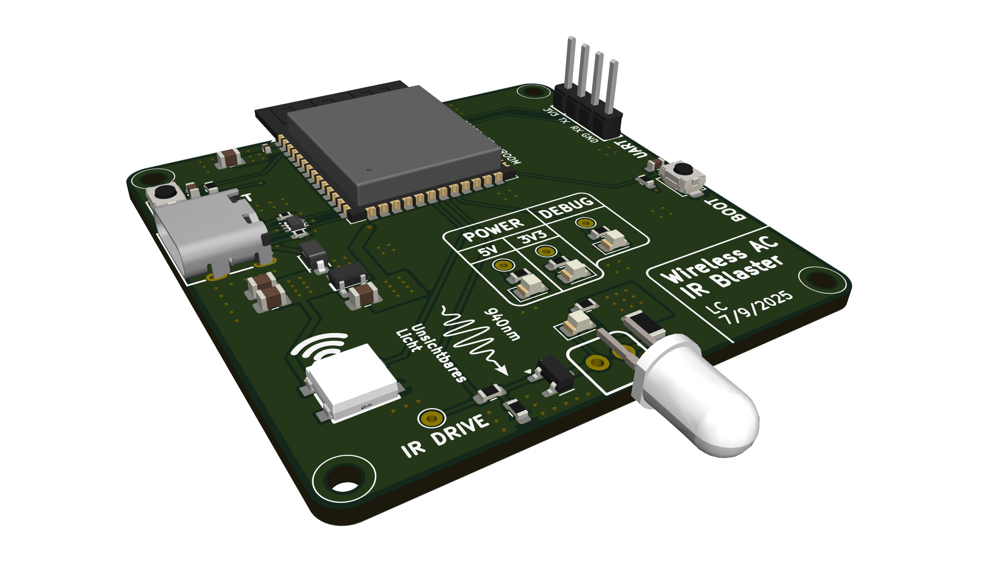
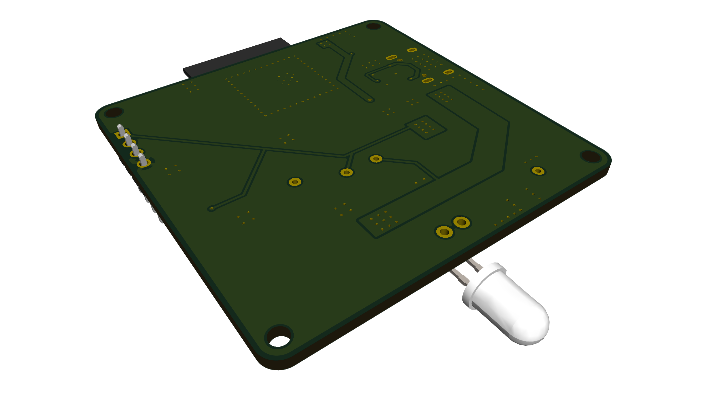

# Wireless Smart IoT IR Blaster for AC Unit

Wireless control of Daikin split system air conditioning unit using IR LED + ESP32-S3.

---
Take a look a the fully sick 3D render:

---
..and now take a look at the fully sick assembled board:

** Under construction **
